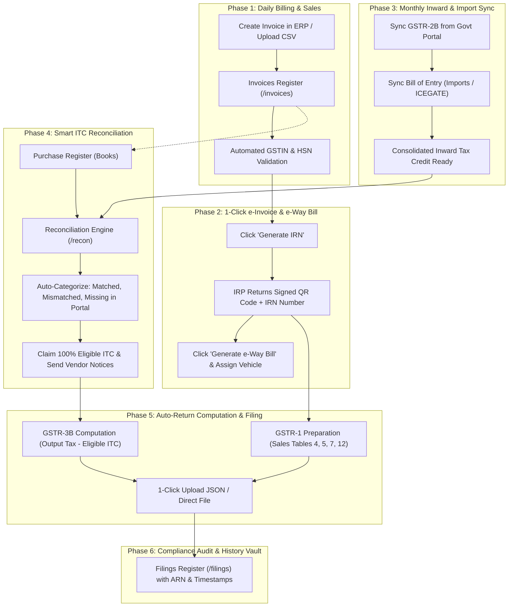

# GST AutoPilot - Client Working Flow & Business Guide

> **A Complete Non-Technical Presentation: What the system does, why it exists, and how it automates your end-to-end GST compliance.**

---

## 1. Executive Summary: What is This System?

**GST AutoPilot** is an intelligent, automated enterprise GST Compliance, e-Invoicing, and Tax Reconciliation platform. 

It acts as a digital bridge between your **ERP / Billing Software** (Tally, SAP, Oracle, Busy, Excel, Custom ERP) and the **Government GSTN & IRP (NIC) Portals**.

```
+------------------+         +----------------------------+         +------------------------+
|   YOUR BUSINESS  |         |       GST AUTOPILOT        |         |    GOVERNMENT PORTALS  |
|  ERP / Invoicing | ------> |   Automated Validation,    | ------> |  • IRP (e-Invoice/IRN) |
|   & Accounting   | <------ |  e-Way Bills, Recon & ITC  | <------ |  • e-Way Bill Portal   |
|     Database     |         |    Return Computation      |         |  • GSTN Portal (1,2B,3B|
+------------------+         +----------------------------+         +------------------------+
```

---

## 2. Why Does Your Business Need This System?

### The Cost of Manual GST Compliance:
| Problem in Manual Process | Business Risk & Penalty | How GST AutoPilot Solves It |
| :--- | :--- | :--- |
| **Lost Input Tax Credit (ITC)** | Businesses lose **3% to 8% of purchase tax credits** because supplier invoices don't match or suppliers failed to file GSTR-1. | **Auto-Reconciliation Engine** matches purchase register with GSTR-2B in seconds and flags defaulting vendors. |
| **Time-Consuming e-Invoicing** | Accountants manually type 50+ fields into the government portal for every bill. Slow and error-prone. | **1-Click Bulk IRN Generation** directly creates government-signed QR codes and IRN numbers instantly. |
| **Transport Delays (e-Way Bills)** | Shipments get delayed or penalized at state checkpoints due to expired or mismatched e-Way bills. | **Instant e-Way Bill Generation & Vehicle Update** directly from the invoice screen. |
| **Math Errors in GSTR-1 & 3B** | Manual calculation leads to mismatches between sales books and tax returns, triggering GST notices. | **Auto-Drafted Returns** aggregates all B2B, B2C, HSN, and Tax slabs automatically with zero math errors. |
| **Multi-Branch Complexity** | Group companies with multiple state GSTINs struggle to track filing status across branches. | **Multi-GSTIN Switcher & Dashboard** gives an instant birds-eye view of all branches in one place. |

---

## 3. End-to-End Client Working Flow (From Sale to Tax Filing)

Here is how your business operates using the system in 6 simple phases:



---

## 4. How Each Screen Works (Feature-by-Feature Client Manual)

### 📊 1. Executive Dashboard (`/`)
* **What it is:** The command center for the CFO, Business Owner, and Finance Head.
* **What you see:**
  * **Net Tax Payable:** Exactly how much cash you owe the government this month (`Output Tax on Sales - Available ITC on Purchases`).
  * **ITC Health Score:** Real-time percentage of purchase bills safely matched and claimable.
  * **Upcoming Filing Deadlines:** Countdown to GSTR-1 (11th of month), GSTR-3B (20th of month), and IFF dates.
  * **Sales vs. Purchases Trend:** Interactive charts comparing outward revenue vs. inward expense tax.

---

### 🧾 2. Invoices & e-Invoicing (`/invoices` & `/einvoice-history`)
* **What it is:** The operational hub for your billing and dispatch team.
* **How it works:**
  1. Your sales invoices sync automatically from your ERP (or upload in bulk via Excel).
  2. The system validates the buyer's GSTIN, tax slabs, and HSN codes.
  3. Click **"Generate IRN"**: In less than 1 second, the government IRP returns an authentic **IRN** and **Signed QR Code**.
  4. Print or email professional tax invoices with embedded QR codes directly to clients.
  5. The **e-Invoice History** page keeps a complete log with one-click cancellation within the 24-hour legal window if an order changes.

---

### 🚚 3. e-Way Bills (`/ewaybills`)
* **What it is:** The logistics & transport compliance station.
* **How it works:**
  1. For shipments exceeding ₹50,000, click **"Generate e-Way Bill"**.
  2. Part-A (consignor, consignee, value) is populated straight from the invoice.
  3. Enter the vehicle number or Transporter ID (Part-B).
  4. Print government-standard e-Way Bills for the driver.
  5. If the vehicle breaks down or changes during transit, update vehicle details or extend validity with 1 click.

---

### 🔍 4. Automated Reconciliation (`/recon`)
* **What it is:** The system's biggest money-saver.
* **How it works:**
  1. Pulls your **Purchase Register** (your internal accounting records).
  2. Pulls **GSTR-2B** (what your vendors actually declared to the government).
  3. The algorithm runs matching on:
     * **GSTIN** of supplier
     * **Invoice Number** (with smart fuzzy matching for prefix/suffix differences like `INV-001` vs `001`)
     * **Date & Tax Amounts** (CGST, SGST, IGST within configurable ±₹1 tolerance).
  4. Segregates results into:
     * ✅ **Matched:** Ready to claim 100% tax credit.
     * ⚠️ **Mismatched:** Discrepancy in tax amount (e.g. vendor reported ₹10,000 instead of ₹12,000).
     * ❌ **Missing in Portal:** Vendor hasn't filed; enables you to hold payment until they file.
     * ⚠️ **Missing in Books:** Invoices on portal that your accounts team missed recording.

---

### 📥 5. Import Customs & Bill of Entry (`/bill-of-entry`)
* **What it is:** Import tax verification for businesses sourcing goods internationally.
* **How it works:**
  * Connects with ICEGATE customs data to pull Bill of Entry declarations.
  * Verifies IGST and customs duties paid at ports so import ITC can be claimed in GSTR-3B without getting blocked by tax authorities.

---

### 📑 6. GST Returns: GSTR-1, GSTR-2B & GSTR-3B
* **GSTR-1 (`/gstr1`):**
  * Auto-groups all outward invoices into government tables: B2B (registered buyers), B2C Large, B2C Small, Export invoices, Credit/Debit Notes, and HSN summary.
  * Preview all tables and download the government-ready JSON payload or upload directly.
* **GSTR-2B (`/gstr2b`):**
  * Auto-drafted monthly ITC statement viewing eligible credits vs. ineligible credits (under Section 17(5) like personal use or motor vehicles).
* **GSTR-3B (`/gstr3b`):**
  * Consolidates output tax liability + eligible ITC.
  * Calculates cash balance required in Electronic Cash Ledger vs. Credit Ledger to settle monthly liability.

---

### 🏛️ 7. Filings Register & Audit Vault (`/filings`)
* **What it is:** Permanent legal archive.
* **How it works:**
  * Stores every filed return with its official **ARN (Application Reference Number)**, date of filing, and filing status.
  * Provides instant proof of compliance during statutory tax audits or department inquiries.

---

### 🏢 8. Multi-Client & Administration (`/onboarding`, `/users`, `/settings`)
* **Client Onboarding (`/onboarding`):** Setup multiple group entities or GSTINs with their specific IRP and GST portal credentials.
* **User Management (`/users`):** Assign fine-grained roles (`Admin`, `Manager`, `Operator`, `Auditor`).
* **Settings (`/settings`):** Configure ERP sync frequency, automated backup schedules, and webhook notifications.

---

## 5. Summary of Business Benefits & Return on Investment (ROI)

| Benefit | Impact on Your Business |
| :--- | :--- |
| **Zero Lost Tax Credit** | Recover 100% of legitimate Input Tax Credit on vendor purchases. |
| **80% Time Reduction** | Eliminate hours spent manually preparing return tables and typing e-invoices. |
| **Zero Penalties & Notices** | Strict pre-validation prevents filing mistakes that trigger department show-cause notices. |
| **Driver & Dispatch Speed** | Generate compliant e-Way Bills instantly to avoid truck detention at state borders. |
| **Single Source of Truth** | CFO, Accountants, and Auditors all work on one unified, real-time dashboard. |

---

## 6. Frequently Asked Questions for Clients

**Q: Does this replace our existing ERP (like Tally / SAP)?**  
*No.* It enhances your existing ERP. Your team continues recording daily sales and purchases in your ERP, and GST AutoPilot automatically handles all the government integration, validation, e-invoicing, e-way bills, and return filing.

**Q: Is our financial data secure?**  
*Yes.* All data transmissions use encrypted SSL/TLS channels, authentication is secured with tokenized sessions and role-based permissions, and sensitive government credentials are encrypted.

**Q: Can we manage multiple companies and branches?**  
*Yes.* The system supports multi-company and multi-GSTIN configurations. You can switch between entities seamlessly using the company selector at the top of the screen.
