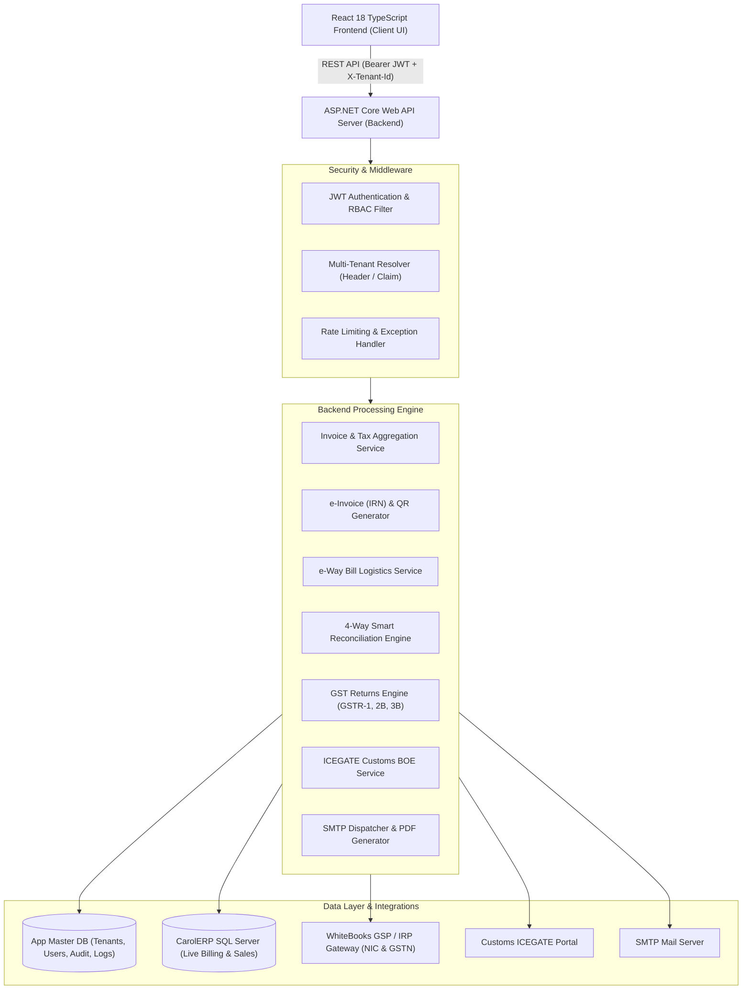
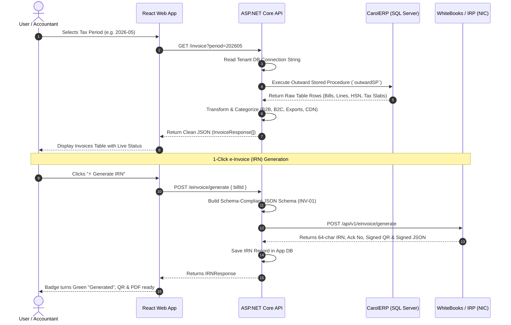
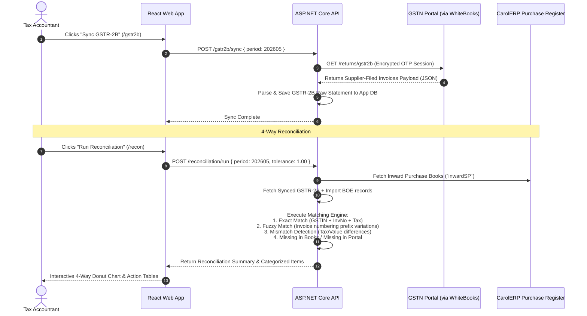

# GST AutoPilot - Complete Backend & System Details Flow

> **Comprehensive Technical Architecture, Backend Data Pipelines, Controller Flows, and External Gateways**

---

## 1. System Topology & Backend Architecture

The backend (`E:\Work\GST\server`) is built on **ASP.NET Core Web API**, providing a multi-tenant, micro-service architecture that interfaces between enterprise ERPs (CarolERP / SQL Server), the React Client UI, and Government GSP/IRP portals (WhiteBooks / NIC / GSTN).

---

## 2. End-to-End Data Ingestion & Processing Pipeline

### Step 1: How Outward Sales Invoices Flow (CarolERP -> Backend -> Frontend)

---

### Step 2: How Purchase Invoices Flow & Auto-Reconciliation (GSTN -> Backend -> Books)

---

## 3. Detailed Backend Controller & Module Map

| Backend Controller | Endpoint Route | Source / Destination | Function & Working Details |
| :--- | :--- | :--- | :--- |
| **`AuthController`** | `POST /auth/login` `GET /auth/me` | App DB + CarolERP | Authenticates credentials, validates employee active status, issues JWT token with claims (`TenantId`, `Role`, `EmplCode`). |
| **`TenantController`** | `POST /tenant/onboard` `POST /tenant/test-connection` `GET /tenant/list` | App DB + SQL Server | Configures multi-tenant connection strings, runs live TCP/SQL handshake tests, sets active database flavor. |
| **`InvoiceController`** | `GET /invoice` `GET /invoice/gstr1` `GET /invoice/gstr1/tables` `GET /invoice/pdf/{billId}` | CarolERP (SQL Stored Proc) | Executes tenant `outwardSP`, validates GSTIN checksums, groups lines by HSN, generates PDF tax invoice with embedded QR. |
| **`EInvoiceController`** | `POST /einvoice/generate` `POST /einvoice/cancel` `GET /einvoice/history` `GET /einvoice/qr` | WhiteBooks IRP Gateway (NIC) | Formats government schema INV-01, encrypts payload, requests IRN/Signed QR code, and handles statutory 24hr cancellation. |
| **`EWayBillController`** | `POST /ewaybill/generate` `POST /ewaybill/update-vehicle` `POST /ewaybill/cancel` | WhiteBooks e-Way Bill API | Combines Part-A (consignor/consignee) from invoice + Part-B (vehicle/transporter) to generate valid government transit permit. |
| **`Gstr2bController`** | `POST /gstr2b/sync` `GET /gstr2b/summary` `GET /gstr2b/b2b` | GSTN Portal API | Downloads auto-drafted ITC JSON from GSTN portal, breaks down into Section 16 (Eligible) vs Section 17(5) (Ineligible). |
| **`Gstr1Controller`** | `POST /gstr1/save` `POST /gstr1/lock` `POST /gstr1/file` | GSTN Portal API | Aggregates outward sales into Tables 4A (B2B), 5A (B2CL), 7 (B2CS), 9B (CDN), 12 (HSN) and submits to GSTN with OTP signing. |
| **`Gstr3bController`** | `GET /gstr3b/calculate` `POST /gstr3b/file` | GSTN Portal API | Calculates Net Tax Payable = `Output Tax (Sales)` minus `Eligible ITC (GSTR-2B)`. Manages electronic cash ledger set-off. |
| **`BillOfEntryController`** | `POST /bill-of-entry/sync` `GET /bill-of-entry/list` | ICEGATE Customs Gateway | Syncs customs import declarations (IMPG) and verifies IGST paid at sea/air ports to enable valid import tax credit claims. |
| **`ReconciliationController`** | `POST /recon/execute` `GET /recon/results` | In-Memory Matching Engine | Executes high-speed 4-way matching algorithm between CarolERP purchase books, GSTR-2B, and ICEGATE customs data. |
| **`UserController`** | `GET /users` `POST /users/roles` `DELETE /users/roles` | App DB + CarolERP Directory | Syncs authorized employees from ERP directory and enforces RBAC (`Admin`, `Manager`, `Operator`, `Auditor`). |

---

## 4. Multi-Tenant Database Architecture

The backend utilizes a **hybrid multi-tenant database pattern**:

1. **Central Application Database (`GST_AppDB`):**
   - **`Tenants`**: Tenant configurations, company legal names, registered GSTINs, state codes.
   - **`TenantCredentials`**: AES-256 encrypted WhiteBooks IRP & GSTN API client keys and secrets.
   - **`UserRoles` & `AuditLogs`**: User permissions and tamper-proof action logs.
   - **`EInvoiceArchive` & `EWayBillArchive`**: Locally cached IRNs, signed QR codes, ACK numbers, and filing receipts.

2. **Tenant ERP Database (`CarolERP_Client`):**
   - Read-only connection to the client's live SQL Server.
   - Accessed strictly through stored procedures:
     - `sp_GST_Outward_Invoices` (or configured custom SP name)
     - `sp_GST_Inward_Purchases` (or configured custom SP name)
     - `sp_GST_GetEmployees`

---

## 5. Security & Compliance Safeguards

- **End-to-End Encryption:** All external communications with NIC, GSTN, and WhiteBooks utilize TLS 1.3 encryption.
- **Statutory Token Isolation:** Government OTPs and auth tokens are kept in encrypted in-memory caches and expire automatically per government compliance rules.
- **Immutable Audit Trail:** Every action (IRN Generation, Return Filing, Invoice Cancellation, Vehicle Update) is recorded with user identity, timestamp, and IP address.
- **Fail-Safe Pre-Validation:** Invoices are mathematically and structurally validated (GSTIN checksum, HSN length, rate verification) before hitting government portals, preventing API rate-limit bans and compliance rejection.
