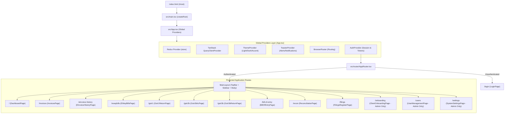
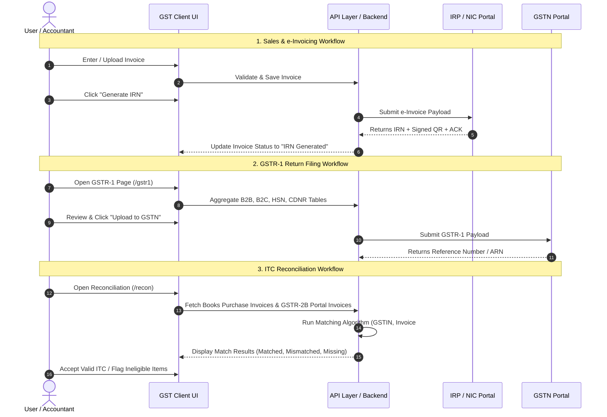

# GST Client - Complete System & Page Flow Guide

---

## 1. System Entry Point & Application Bootstrap

### Bootstrap Sequence Step-by-Step:
1. **`index.html`**: The static HTML page loaded by the browser containing the mount point `

`.
2. **`src/main.tsx`**: Renders `<App />` using React 18 `createRoot`.
3. **`src/App.tsx`**: Wraps the whole application with required providers:
   - **`Provider (Redux)`**: Centralized state management for global application states.
   - **`QueryClientProvider`**: React Query client caching API responses, managing background refetching and mutation states.
   - **`ThemeProvider`**: Theme state (light/dark mode and active accent colors).
   - **`ToasterProvider`**: Global toast notification system.
   - **`BrowserRouter`**: HTML5 history API router.
   - **`AuthProvider`**: Manages user authentication state, tokens in `localStorage` (`gstautopilot.user`), and auto-logout on unauthorized events.
4. **`src/router/AppRouter.tsx`**: Determines routing rules:
   - If not authenticated, routes the user directly to `/login`.
   - If authenticated, directs the user inside `MainLayout` with lazy-loaded route components.

---

## 2. Authentication & Authorization Flow

- **Storage**: Auth user metadata & tokens are persisted in `localStorage` (`gstautopilot.user`).
- **Session Check**: On load, `AuthProvider` checks whether the session is valid and not expired.
- **Interceptors**: Axios API client attaches `Authorization: Bearer <token>` to outbound requests. If a `401 Unauthorized` response is returned, the client emits `gstautopilot:unauthorized`, triggering cleanup and routing the user to `/login`.
- **Role-Based Access Control (RBAC)**: `ProtectedRoute` checks the user's role (e.g., `Admin`). Unauthorized roles navigating to admin-only pages get redirected back to `/`.

---

## 3. UI Layout Architecture

All authenticated pages are wrapped inside **`MainLayout`** (`src/components/layout/main-layout/MainLayout.tsx`):
- **TopBar (`src/components/layout/topbar/TopBar.tsx`)**:
  - Global Search bar (invoices, clients, HSN codes).
  - Quick action shortcuts (e.g., New Invoice, Sync).
  - Multi-Company Selector dropdown.
  - Theme toggler (Light / Dark) and accent color picker.
  - User profile menu and Logout trigger.
- **Sidebar (`src/components/layout/sidebar/Sidebar.tsx`)**:
  - Navigation grouped into 4 distinct sections: **Main Menu**, **GST Returns**, **Audit & Reconciliation**, and **Administration**.
  - Collapsible desktop sidebar and responsive mobile slide-out drawer.
- **Content Area**: Dynamic router outlet where page components are rendered.

---

## 4. Complete Page-by-Page Functional Breakdown

### 1. 🔐 Authentication
| Page | Route | Access | Key Functionality |
| :--- | :--- | :--- | :--- |
| **Login** | `/login` | Public | Employee code/username + password credentials authentication, JWT handling, session persistence, and redirection. |

---

### 2. 📊 Main Menu
| Page | Route | Access | Key Functionality |
| :--- | :--- | :--- | :--- |
| **Dashboard** | `/` | All Users | • Executive KPI Cards (Total Sales, Purchases, Net Tax Payable, Available ITC). • Real-time chart visualization for Outward Liability vs. Inward ITC. • GST filing deadlines and countdown alerts. • Quick-action shortcut cards for pending tasks (unmatched invoices, pending IRN generation). |
| **Invoices** | `/invoices` | All Users | • Central invoice register for outward (sales) and inward (purchases). • Advanced filtering (by GSTIN, date range, invoice status, invoice type). • Bulk CSV/Excel invoice import & export. • Direct actions: **Generate IRN** (e-Invoice) and **Generate e-Way Bill**. • Automated data validation (GSTIN checksum, HSN code, tax calculation). |
| **e-Invoice History** | `/einvoice-history` | All Users | • Audit register of all e-invoices registered on the IRP / NIC portal. • View IRN, Signed QR codes, and ACK numbers. • Real-time status tracker (Active, Cancelled, Failed). • JSON payload & error response viewer for debugging. • IRN cancellation workflow within allowed 24-hour compliance window. |
| **e-Way Bills** | `/ewaybills` | All Users | • e-Way Bill lifecycle management. • View generated e-Way Bills with Part-A (Consignor/Consignee) and Part-B (Transporter/Vehicle) data. • Update vehicle number, change transporter, and extend validity. • Direct print/export of government-compliant PDF e-Way Bills. |

---

### 3. 📑 GST Returns
| Page | Route | Access | Key Functionality |
| :--- | :--- | :--- | :--- |
| **GSTR-1 Return** | `/gstr1` | All Users | • Preparation, review, and filing of Outward Supplies Return. • Table-wise breakdown: B2B (4A/4B), B2CL (5A), B2CS (7), Credit/Debit Notes (9B), Exports (6A), HSN Summary (12), Document Issue Summary (13). • Error validation report before upload. • Direct JSON generation and GSTN portal sync. |
| **GSTR-2B ITC** | `/gstr2b` | All Users | • Auto-drafted Input Tax Credit (ITC) statement inspection. • Categorization into Eligible ITC vs. Ineligible ITC (Section 16/17(5)). • Vendor-wise breakdown of tax credits uploaded by suppliers. • Auto-refresh from GST portal. |
| **GSTR-3B Return** | `/gstr3b` | All Users | • Monthly consolidated summary return preparation. • Auto-computation of net tax liability (CGST, SGST, IGST, Cess). • Cash ledger vs. Credit ledger balance calculation for tax liability offset. • Preparation of final filing payload. |
| **Bill of Entry** | `/bill-of-entry` | All Users | • Import tracking and customs declarations integration (ICEGATE). • Bill of Entry verification. • IGST paid on imports reconciliation to ensure legitimate ITC claims. |

---

### 4. 🔍 Audit & Reconciliation
| Page | Route | Access | Key Functionality |
| :--- | :--- | :--- | :--- |
| **Reconciliation** | `/recon` | All Users | • Automated 2-way and 3-way matching engine (Purchase Register vs. GSTR-2B / GSTR-2A). • Status matching: **Exact Match**, **Value/Tax Mismatch**, **Missing in Books**, **Missing in Portal**. • Configurable tolerance limits (e.g. ± ₹1.00 rounding). • Bulk accept/reject and automated vendor reminder notifications. |
| **Filings Register** | `/filings` | All Users | • Historical compliance ledger and audit repository. • Tracks ARN (Application Reference Number), filing dates, and periods for GSTR-1, GSTR-3B, and GSTR-9/9C across financial years. |

---

### 5. ⚙️ Administration
| Page | Route | Access | Key Functionality |
| :--- | :--- | :--- | :--- |
| **Client Onboarding** | `/onboarding` | Admin Only | • Multi-entity client and branch registration. • GSTIN configuration, legal trading name, and address setup. • IRP / NIC portal API credentials setup for automated e-invoicing. • ERP connector integration configuration. |
| **User Management** | `/users` | Admin Only | • Role-Based Access Control (RBAC) management. • Manage user accounts and assign roles (`Admin`, `Manager`, `Operator`, `Auditor`). • User activation, password resets, and permission grants. |
| **System Settings** | `/settings` | Admin Only | • System configuration, API URLs, and ERP sync intervals. • Webhook and notification preferences. • System health monitoring and audit logs. |

---

## 5. Summary Flow Chart of Key Business Operations

